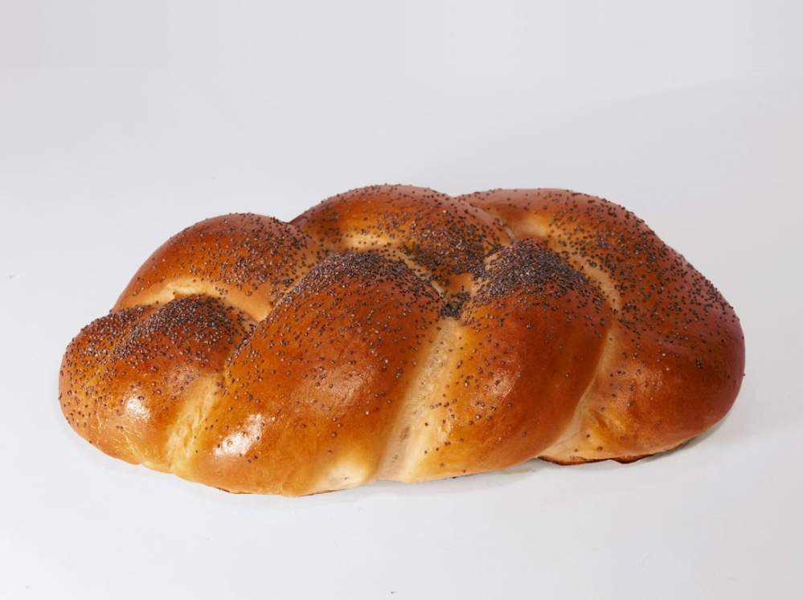

<!DOCTYPE html>
 <html lang="ru">
 <head>
   <meta charset="utf-8"/>
   <title>Магазин Булочек</title>
   </head>
   <body>
     <header class="main-header">
       

         <nav class="main-navigation">
           <ul>
             <li>
               <a href="#">Информация</a>
               </li>
               <li>
                 <a href="#">Новости</a>
                 </li>
                 <li>
                   <a href='#'>Прайс-лист</a>
                 </li>
                  <li>
                    <a href="#">Магазин</a>
                  </li>
                  <li>
                    <a href="#">Контакты</a>
                    </li>
                    </ul>
          </nav>
           

             <a class="login" href="#">Вход</a>
             

     

     </header>
     <main class="container">
       

         >">
         

         <section class="features">
           

             <b class="feateures-name">Престиж</b>
             
Забудьте про плохую выпечку.Мы сделаем для вас лучший хлеб который вы пробовли.

             

             

               <b class="features-name">Качество</b>
               
Наши мастера- профессионалы своего дела не стоят дёшего. Но за выпечку берут скромные деньги по сравнению с качеством и вкусом нашей  продукции

               

               

                 

                   <h2 class="index-content-title">Новости</h2>
                   <ul class="news-preview">
                     <li>
                       
Мы наконец то приобрели card reader что значит что вы сможете оплачивать покупки при помощи своей карты(А также добавлена система скидок)

                       <time datetime="2019-02-26">26 февраля</time>
                       </li>
                       </ul>
                       <a class="btn" href="#">Все новости</a>
                       

                         <h2 class="index-content-title">Фотогаллерея</h2>
                         <figure class="gallery-content">
                           
                           <button class="btn galley-prev">Назад</button>
                           <button class="btn gallery-next">Вперёд</button>
                           

                             

                               <h2 class="index-content-title">Контактная информация</h2>
                                 

                                   Магазин хлебобулочных издейли "БУЛКИН" 
                                   Адрейс:г.Москва, Ул Пушкина, д. 19/22 
                                   Телефон:+7 (800) 555-35-35
                                   

                                   

                                     Время работы: 
                                     пн-пт: с 10:00 до 20:00 
                                     сб-вс: с 10:00 до 19:00
                                     

                                     

                                       

                                         <h2 class="index-content-title>">Условия доставки</h2>
                                         
 Доставка осуществляется по МСК области от 350 рублей + 5о руб за 1 км от мкада 

                                         <a class="btn" href="yandex.ru">Как проехать</a>
                                         <a class="btn" href="vk.com">Обратная связь</a>
                                         

                                         

                                           <h2 class="index-content-title">Забранировать</h2>
                                           
 Укажите желаему дату и время и мы свяжемся с вами для подтвержения брони 

                                           

                                           <form class="appointment-form" action="https://yandex.ru" method="post">
                                             <input type="text" name="data" value="" placeholder="Дата">
                                             <input type="text" name="time" value="" placeholder="Время">
                                             <input type="text" name="name" value="" placeholder="Имя">
                                             <input type="tel"  name="phone" value="" placeholder="Телефон">
                                             <button class="btn" type="submit">Отправить</button>

                                             </form>
                          

                      

                   

                 

           </section>
       </main>
       <footer class="main-footer">
         

           <section class="footer-contacts">
             Магазин хлебобулочных издейли "БУЛКИН" 
             Адрейс:г.Москва, Ул Пушкина, д. 19/22 
             <a href="yandex.ru">Как нас найти</a>

           </section>
           <section class="footer-social">

             </section>
             <section class="footer-copyright">

               </section>

           

   </body>
  </html>
